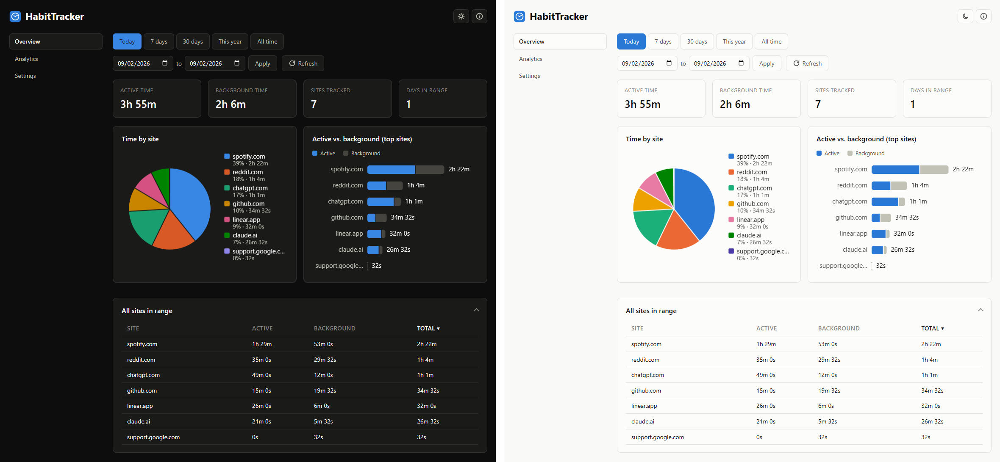
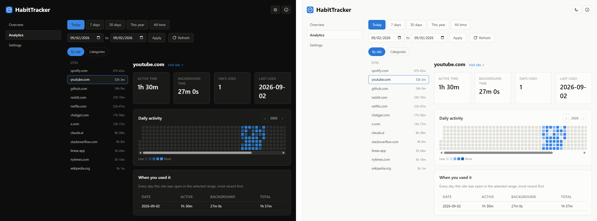
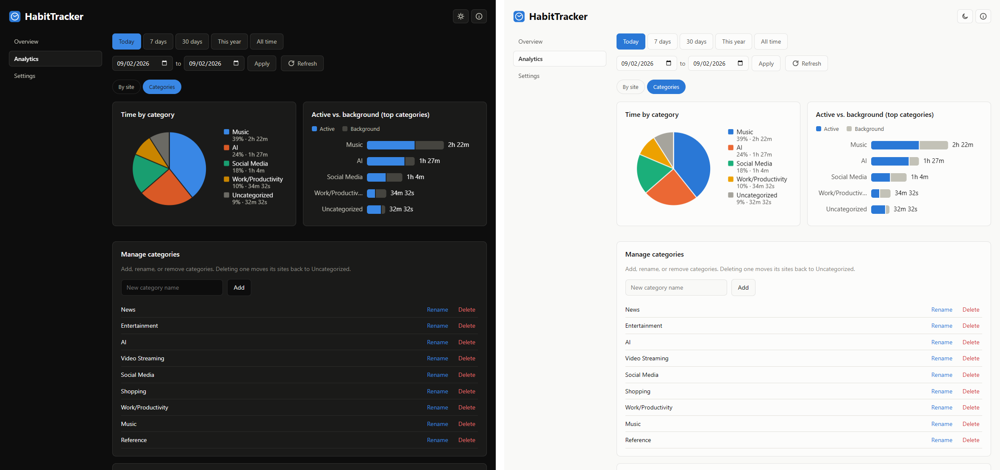
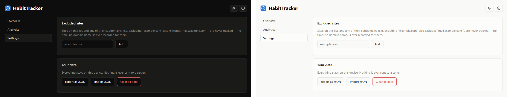
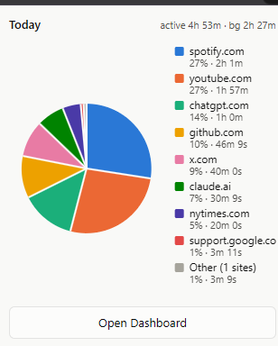

# HabitTracker

A local-only time tracker for Chromium-based browsers (Brave, Chrome, Edge,
Opera, Vivaldi, etc.). Tracks how long you spend on each site — split into
**active** (tab focused, window focused) and **background** (tab open
somewhere but not the one you're looking at) — with charts, a per-site
history and yearly activity heatmap, and category grouping. Nothing ever
leaves your device: no network requests, no analytics, no accounts.

## Screenshots

Each shows dark mode (left) and light mode (right). The sites shown are
sample data seeded for these screenshots — not anyone's real browsing.

**Overview**

**Analytics → By site** — day-by-day history and a yearly activity heatmap

**Analytics → Categories** — time grouped by category, with management

**Settings**

**Popup**

## About this project

I'm not a programmer — this whole extension was built by an AI (Claude,
via Claude Code), start to finish. I just wanted a way to see how much time
I was actually spending on certain sites (the usual doom-scrolling/habit
suspects) without installing something that phones my browsing history
home to some company's server. I liked how it turned out, so I'm sharing it
in case it's useful to anyone else who wants the same thing.

Because of that, I can't personally debug deep code issues — but I can
pass anything along to be fixed. See **Feedback & contact** below.

## Install (unpacked — this isn't on the Chrome/Edge Web Store)

1. Open your browser's extensions page: `brave://extensions`,
   `chrome://extensions`, or `edge://extensions` (same idea everywhere).
2. Turn on **Developer mode** (usually top right).
3. Click **Load unpacked** and select this folder.
4. Pin the "HabitTracker" icon to the toolbar if you want quick access.

Reload the extension from that same extensions page after editing any file.

## What it tracks

- Only the **domain** (e.g. `github.com`), never the full URL, path, or query
  string.
- Only in normal windows — Private/Incognito windows are skipped (and
  unpacked extensions aren't loaded into them by default anyway).
- Time keeps accumulating for background tabs even while you're not looking
  at them; it pauses entirely while your system is idle or locked, so
  stepping away doesn't inflate any site's numbers.

Because the install prompt for the `tabs` permission says "Read your browsing
history" — that's just what lets the extension see which domain each open
tab is on; the data still never leaves `chrome.storage.local` on your
machine.

## What's in the dashboard

- **Overview** — totals, a pie + bar chart, and a sortable table for
  whatever date range you pick (today / 7 days / 30 days / this year / all
  time / custom).
- **Analytics → By site** — pick a site to see its day-by-day history and a
  GitHub-style yearly activity heatmap.
- **Analytics → Categories** — the same totals grouped into categories
  (News, AI, Video Streaming, etc.) instead of by site; manage your own
  categories and assign sites to them here.
- **Settings** — exclude sites from tracking (and their subdomains), back up
  your data as JSON, or clear everything.
- Light/dark toggle in the header, independent of your OS setting.

## Excluding sites

Dashboard → Settings → **Excluded sites**. An excluded domain (and its
subdomains) is never written to storage at all — not the time, not even the
domain name.

## Backing up your data

Dashboard → Settings → **Export as JSON** / **Import JSON**. Data is kept
indefinitely (aggregated per day, so even years of history stays small) —
export is just an extra safety net, e.g. before switching machines.

## Feedback & contact

Suggestions, feature ideas, and bug reports are all welcome — this is a
side project I'm happy to keep improving.

- **GitHub Issues** (preferred): click the "Issues" tab on this repository
  and open a new one describing what you'd like changed or what broke. It's
  public, so anyone can see and follow along — that's normal for open
  source projects, not a problem.
- **Email**: habit.tracker.ext@gmail.com

## Files

| File | Purpose |
|---|---|
| `manifest.json` | Extension manifest (MV3) |
| `background.js` | Service worker — does all the time accounting |
| `common.js` | Shared helpers (domain parsing, categories, date/duration formatting) |
| `charts.js` | Hand-rolled canvas pie + bar chart renderers |
| `popup.html/js/css` | Toolbar popup — today's summary |
| `dashboard.html/js/css` | Full dashboard — Overview, Analytics, Settings |
| `theme.css` / `theme-init.js` | Shared color tokens and light/dark theme handling |
| `icons/` | Extension icon (16/32/48/128px) |
